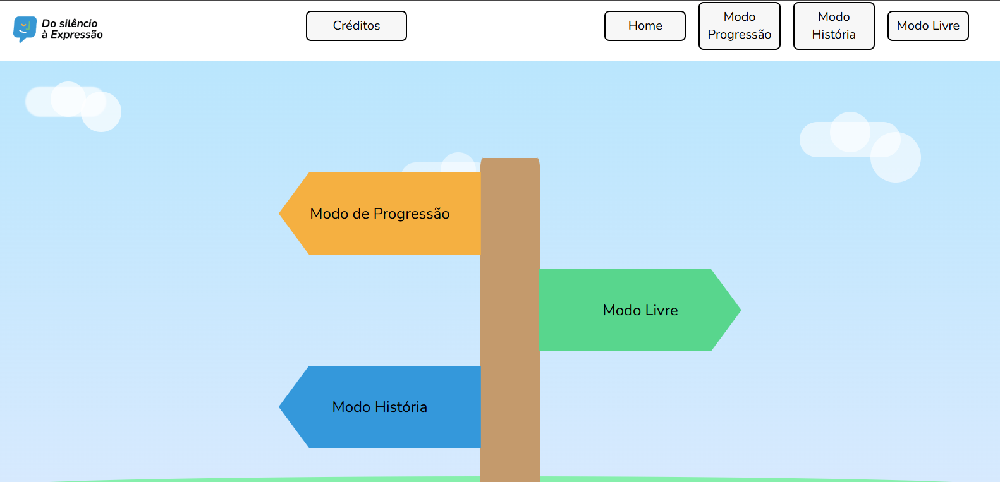
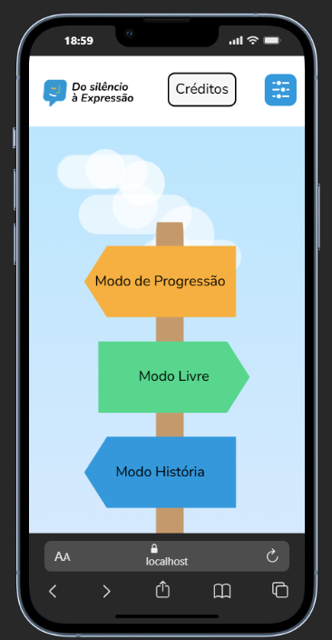
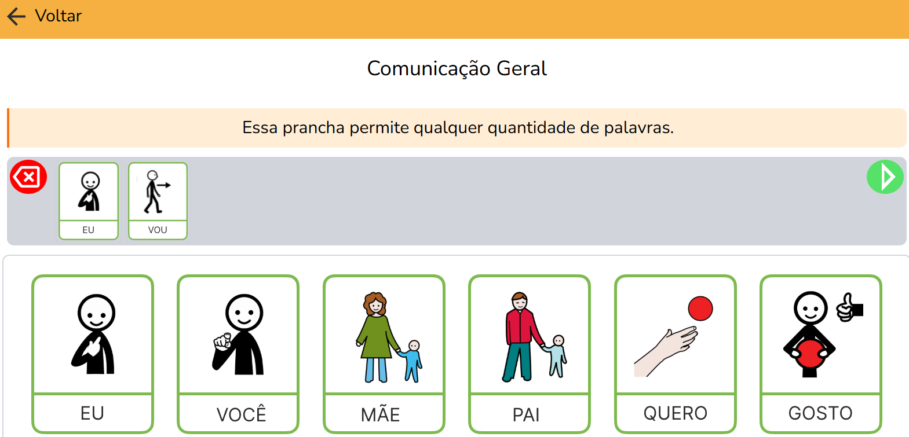
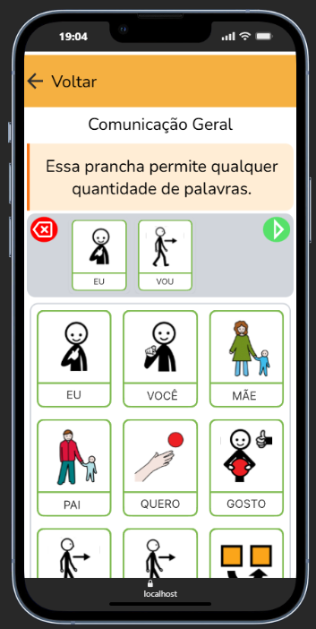
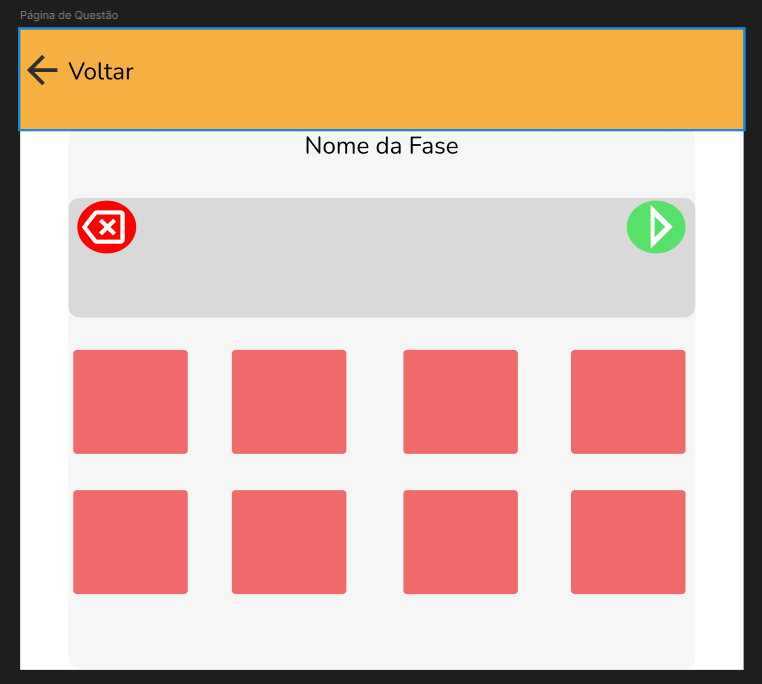
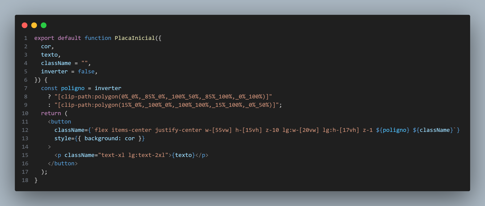
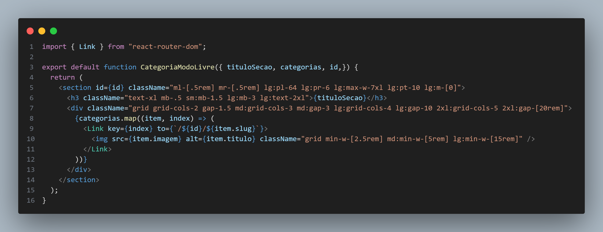

# Do Silêncio à Expressão

Uma ferramenta web desenvolvida para auxiliar a comunicação entre pessoas com Transtorno do Espectro Autista (TEA) não verbal e seus familiares, cuidadores, educadores e demais pessoas do convívio diário, utilizando Comunicação Aumentativa e Alternativa (CAA).

## 📖 Sobre o Projeto

O **Do Silêncio à Expressão** foi criado com o objetivo de tornar a comunicação mais acessível para pessoas autistas não verbais, oferecendo uma interface simples, intuitiva e acolhedora para a construção de frases e expressão de necessidades, sentimentos e desejos.

A plataforma busca reduzir barreiras comunicacionais e promover maior autonomia, inclusão e interação social por meio de recursos visuais e sonoros.

## 🌐 Acesse o Projeto

🔗 **Site:** https://do-silencio-a-expressao.vercel.app/

> O código-fonte deste projeto é privado. Este repositório tem como finalidade apresentar o projeto, sua proposta, tecnologias utilizadas e demonstrações de funcionamento.

---

## ✨ Principais Funcionalidades

* Construção de frases por meio de elementos visuais.
* Conversão das frases em fala utilizando síntese de voz.
* Interface acessível e intuitiva.
* Design pensado para reduzir sobrecarga sensorial.
* Navegação simples para diferentes faixas etárias.
* Totalmente responsivo para computadores, tablets e smartphones.

---

## 🛠️ Tecnologias Utilizadas

### Front-end

* React
* Javascript
* Figma
* Tailwind CSS

### Recursos Web

* SpeechSynthesis API (Web Speech API)

---

## 📱 Responsividade

O sistema foi desenvolvido seguindo uma abordagem responsiva, garantindo uma experiência consistente em diferentes dispositivos:

* Desktop
* Notebook
* Tablet
* Smartphone

---

## 🎨 Design e Experiência do Usuário

O design foi pensado considerando aspectos importantes para usuários autistas não verbais:

- Interface limpa e organizada.
- Redução de elementos visuais excessivos.
- Navegação previsível.
- Feedback visual claro.
- Paleta de cores suave e confortável.
- Ícones de fácil identificação.

---

## 🖼️ Demonstração da Interface

### Página Inicial

#### Versão Desktop

<p align="center">
  
</p>

#### Versão Mobile

<p align="center">
  
</p>

A tela inicial apresenta os diferentes modos de utilização da plataforma através de uma navegação visual simples e intuitiva.

---

### Montagem de Frases

#### Versão Desktop

<p align="center">
  
</p>

#### Versão Mobile

<p align="center">
  
</p>

A funcionalidade principal da aplicação permite a construção de frases utilizando pictogramas e elementos visuais, que posteriormente podem ser reproduzidos por voz através da SpeechSynthesis API.

---

### Protótipo Inicial

<p align="center">
  
</p>

Protótipo desenvolvido durante a fase de planejamento da interface, utilizado para validar a disposição dos elementos e o fluxo de interação antes da implementação final.

---

## 🧩 Arquitetura e Implementação

### Estrutura do Projeto

> Adicione aqui uma visão geral da estrutura de pastas ou arquitetura da aplicação.

```txt
src/
    pages/
        ├── assets/
        ├── components/
        └── hooks/   
```

### Trechos de Código

#### Componente das Placas de Início


#### Componente das Categorias


---

## 🔊 Síntese de Voz

A plataforma utiliza a **SpeechSynthesis API**, permitindo que frases construídas pelo usuário sejam reproduzidas por voz, facilitando a comunicação com outras pessoas.

### Exemplo

```javascript
const utterance = new SpeechSynthesisUtterance(texto);
speechSynthesis.speak(utterance);
```

---

## 🎯 Público-Alvo

* Pessoas com TEA não verbal.
* Familiares.
* Cuidadores.
* Professores.
* Profissionais da saúde.
* Instituições de ensino.

---

## ♿ Acessibilidade

O projeto busca seguir boas práticas de acessibilidade digital, priorizando:

* Navegação intuitiva.
* Elementos visuais de fácil identificação.
* Compatibilidade com diferentes tamanhos de tela.
* Feedback visual e auditivo.
* Redução de distrações visuais.

---

## 📄 Licença

Este projeto possui fins acadêmicos e de pesquisa.

---

## 👨‍💻 Autor

**Breno Olegário Seixas**

Desenvolvido como uma iniciativa voltada à inclusão, acessibilidade e comunicação assistiva para pessoas com TEA não verbal.
